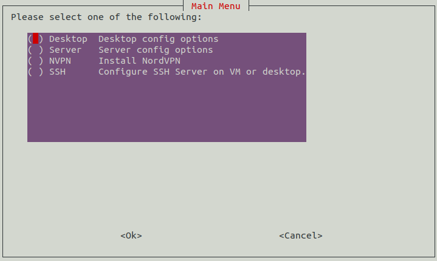

# Bits of Bash
This script aims to provide the user with a modular structure for creating interactive bash scripts.

Instead of having several scripts, simply create a function using the "bonesMalone" function as your guide. Once the function is complete, add an entry to the menu or submenu of your choice so that the option can be presented to the user. This script has samples of making menus using whiptail and dialog.
<br><br>
## Getting Started
As you would with all scripts you find on the internet, please read it to make sure you understand what the code does and how it would affect your system. 

Tested on the following distros:
- Ubuntu 18.04
- Debian 10.2
- Kali Linux 2020 1b
- XCP-ng 8.1

### Requirements/Dependencies

- sudo privileges. 
- The package "dialog". The script will automatically install this for you if it is missing.

<br>

## Running the script
Use the command:
```
sudo bash bitsOfBash.sh
```
<br><br>
The first menu that is presented to you will set a global variable that represents your working environment. This is useful if you need to write a function that will perform an action based on the working environment. (eg. Using yum instead of apt.)
<br>

<br><br>
You will be asked to select a user. This will set the global variable that represents your working user. This is useful when creating functions that require a target user directory or setting the ownership of a file.
<br>

<br><br>
Using menus are a great way to organize your functions. In the image below, the "Desktop" and "Server" options are submenus containing functions related to those environments.
<br>

<br><br>
Below is a sample of a submenu that has a few of the functions I have in my personal script.
<br>

<br><br>

## Using the template bonesMalone
This is the basic format for the functions used in this script.
- Setp 1 - Apply a starting timestamp to the log file.
- Step 2 - Check if the global variable "debugSwitch" has been set. This is useful for testing the flow of deeply nested menus and exiting to a specific point or menu.
- Step 3 - Run the intended commands.
- Step 4 - Check if the function call is a part of a chain of function calls. This means that the function will not exit to the main menu if another function call follows. (Multiple calls. eg. installNordVPN chFctnCall -> updatesAndPkgs). Apply the ending timestamp if the function call is not being chained.

<br>


## Adding to a menu
Insert an entry into the relevant whiptail menu and switch statement.

<br>


## License

This project is licensed under the GNU General Public License v3.0 - see the [LICENSE.md](LICENSE) file for details.
